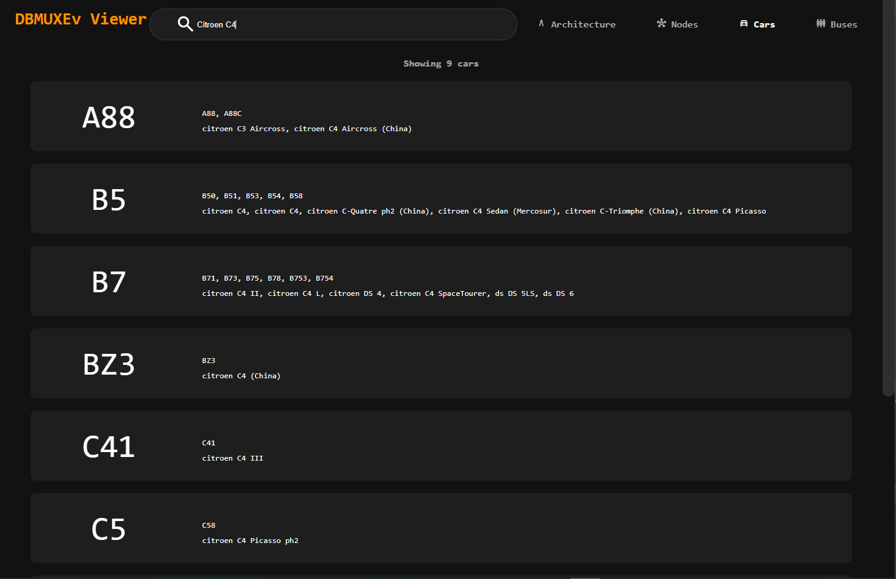
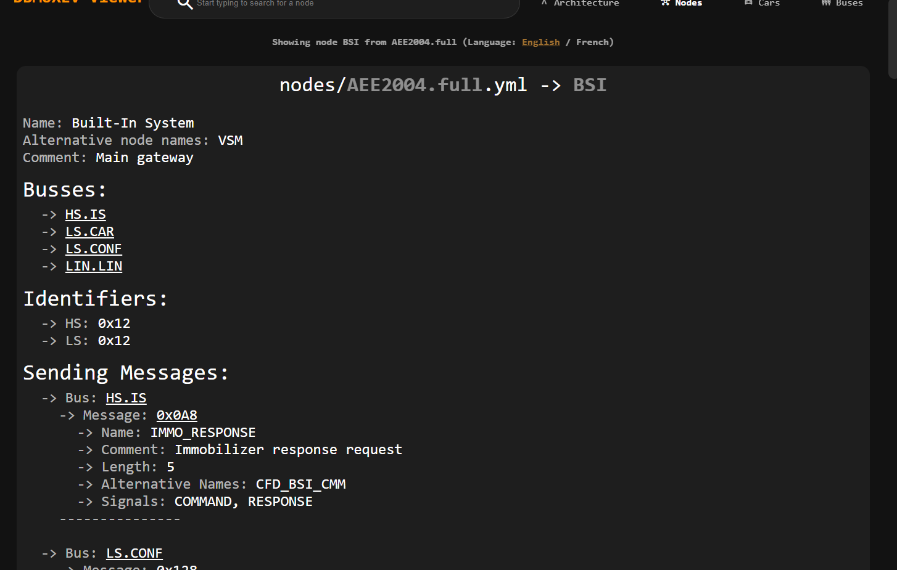
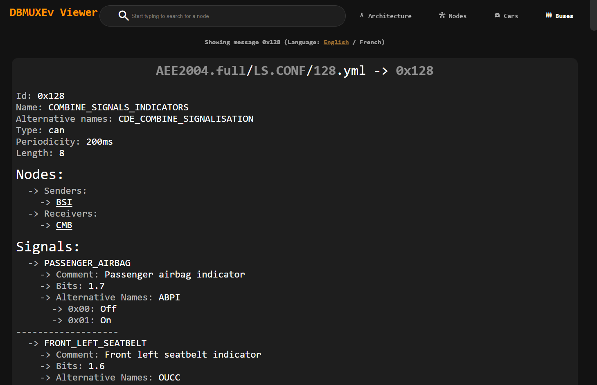
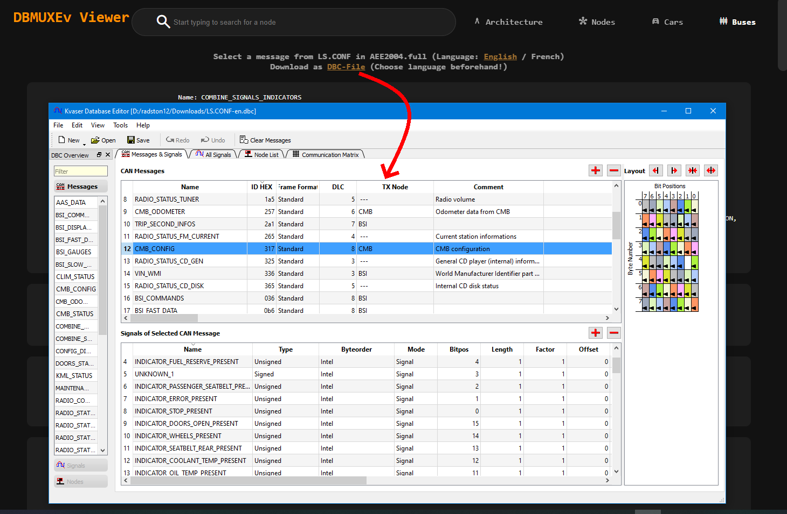

# PSA-RE-Web

## Intro 

This tool is for looking at the database and converting it to a .dbc

## Installation

To install this project run

```sh
npm i
```

and to run 

```sh
npm start
```

A web server will start on defaultly port 3000 (see configuration.json)

To exit out of it simply use `CTRL + C`

## TODO / Current plans / Help appreciated

- In the future I plan on supporting "online" editing
- Mobile Interface / Interface that works perfectly below 1280px width 

## Pictures of the Web UI 




